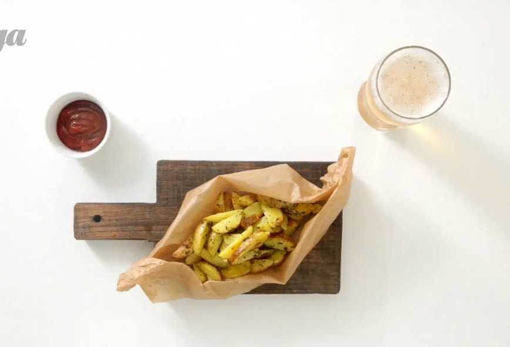
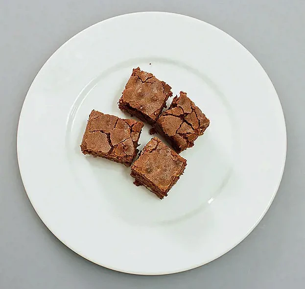
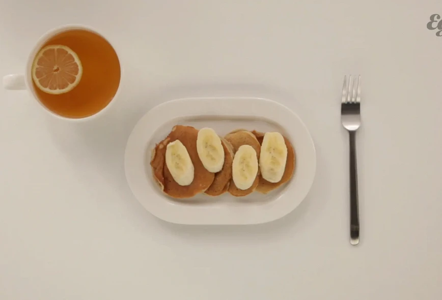
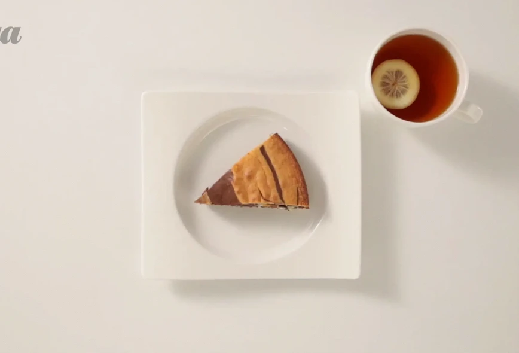

# Список рецептов:

- Основные блюда:
	- [Курица «Пикассо»](picasso.md)
	- [Картофель «Айдахо»](aidaho.md)
- Выпечка:
	- [Брауни](brownie.md)
	- [Банановые панкейки](banana.md)
- Десерты:
	- [Пирог «Зебра»](zebra.md)